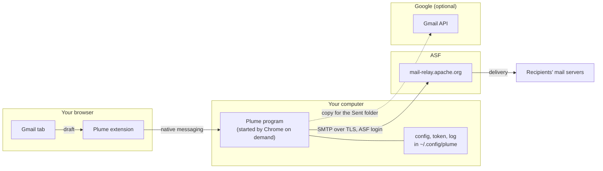
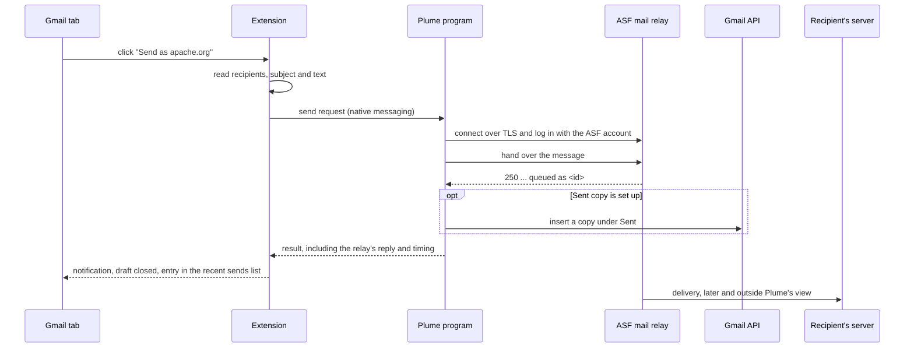

# Architecture

Plume is a Chrome extension and a small local program. The extension adds a "Send as apache.org" button
to Gmail and reads the draft when you click it. Chrome then starts the program, which sends the message
through `mail-relay.apache.org`, the ASF's mail submission server. Plume never delivers mail itself. It
only hands messages to the relay.



The extension runs in the browser, and only on `mail.google.com`. The program runs on your machine, and
only while a message is being sent. The two talk through Chrome's native messaging, so no network port is
open. The program connects to the relay over TLS and logs in with your ASF account. If you have set up a
copy in Gmail's Sent folder, it also calls the Gmail API.

## Sending through the ASF relay

The relay is what makes a message come from apache.org. A receiving server wants to know that the machine
that sent a message is one the sender's domain allows to send for it, and the ASF allows its own relay to
send for apache.org. Google's servers are not allowed to, so a message with an apache.org sender that went
out through them would look forged.

Gmail's "Send mail as" got around this by passing your messages on to the same relay. You gave Gmail the
relay's host name and your ASF login, and it did the rest. Google is dropping that in January 2027, and
Plume makes the same hand-off from your own machine. As far as the relay is concerned, Plume is an ordinary
SMTP client, no different from Thunderbird, so nothing has to be set up on the ASF side. How the ASF
configures its domain, for example which checks it publishes, is up to the ASF and outside Plume's control.

Incoming mail is not affected. Messages sent to your apache.org address still reach Gmail through the ASF's
forwarding, and Plume is not involved.

## The life of a message



After the click, the extension reads the recipients, subject and text and asks the program to send them.
The program builds the message, connects to the relay, logs in and hands the message over. The relay
answers with a queue ID (`250 ... queued as ...`), and Plume takes that as success. If the Sent copy is set
up, the program then files a copy through the Gmail API. A failure there is reported but does not undo the
send, because the mail is already out. Finally the extension shows a notification, closes the draft and
records the send in its list of recent sends.

Delivery from the relay to the recipients happens after Plume is done, so Plume cannot see it. That is why
the notification includes the relay's queue ID: when a message arrives late, the ID lets ASF
Infrastructure find it in their logs.

## The program

The code is in `server/plume/`. The send logic sits behind small interfaces, called ports, and every port
has a fake in the tests.

```
app.py (HTTP, debugging) ┐
native.py (Chrome host)  ┴-> api.send_payload -> service.SendService -> ports.Mailer      <- relay.SmtpRelayMailer
                                                                       -> ports.SentArchive <- gmail.GmailArchive | archive.NullArchive
gmail.GmailArchive -> tokens.TokenProvider -> oauth.GoogleOAuth, ports.TokenStore <- tokens.FileTokenStore
                   -> ports.Transport <- transport.UrllibTransport
```

There are two ways in: the browser's native messaging (`native.py`) and a token-protected HTTP endpoint that is
meant for debugging (`app.py`). Both call `api.send_payload`, so a send behaves the same either way.
`SendService` sends through the mailer first and only then tries to archive a copy, which is why an
archiving problem cannot fail a send. `relay.SmtpRelayMailer` is the only code that talks to the ASF relay,
and it also keeps the relay's reply to the DATA command, which is where the queue ID is. `wiring.py`
builds the whole graph from the configuration and `cli.py` exposes it as commands (`setup`, `configure`,
`install-host`, `check`, `native`, `serve` and `auth`). To add another kind of archive, such as IMAP APPEND,
implement `SentArchive` and select it in `wiring.py`.

The program serves every browser through one interface. `browsers.py` has a small class per browser family
that knows whether the browser is installed, where its host manifest goes and how that manifest names the
extensions allowed to start the host: Chromium browsers use `allowed_origins`, Firefox uses
`allowed_extensions`. `install.py` works only through that interface, and `launch.py` recognises that a
browser started the program, whichever browser it was.

## The extension

The code is in `extension/src/`. A content script runs on `mail.google.com`, and a background worker
handles the communication with the program.

`content.js` finds compose windows, adds the button and shows notifications. It uses `gmail-dom.js`, which
holds every Gmail-specific selector and reads recipients, subject and body from a compose window, and
`dom-text.js`, which turns the body into plain text with quoted replies as `> ` lines. For replies,
`reply-context.js` looks up the Message-ID and References of the message being answered.

`background.js` receives the draft and sends it to the program with `sender.js`, using native messaging by
default. It also adds the result to the list of recent sends kept by `history.js`. `settings.js` and
`options.html` deal with the extension's settings and show that list.

### One codebase, one target per browser

Everything above is shared by all browsers, and none of it names a browser. The shared code reaches the
extension API only through `platform.js`, which uses `browser` where it exists (Firefox) and `chrome`
otherwise, and a test fails if any other file in `src/` uses either name or `importScripts`. What is
specific to a browser lives in `targets/<browser>/`:

- `manifest.patch.json` is a JSON merge patch applied to the base `manifest.json`, which is the Chrome
  manifest. The Chrome patch is empty. The Firefox patch removes the Chrome-only keys, replaces the service
  worker with an event page and declares the add-on ID.
- Files that only that browser needs. Chrome's background is a service worker that has to load its own
  scripts, so `targets/chrome/service-worker.js` does that. Firefox lists the same scripts in its manifest.

`scripts/build-extension.js <target>` assembles a package from the shared sources and one target, and refuses
to build if the manifest points at a file that was not packaged. Tests check that Chrome's package is exactly
the base manifest, that Firefox differs from it only in the four keys that have to differ, and that no package
contains another target's files. Adding a browser means adding a directory under `targets/`. A change for one
browser cannot reach another, because it is not in the code they share.

Gmail's markup is not a public interface and can change at any time, so the selectors in `gmail-dom.js` are
the part most likely to need attention. [selectors.md](selectors.md) explains how to check them.

## State

The program keeps its files in `~/.config/plume`: `config.json` with the ASF user name and password,
`gmail-token.json` if the Sent copy is set up, and `host.log` with errors from the native host, since Chrome
throws away its stderr. The password file is readable only by you but is not encrypted. The extension keeps
its settings and the list of recent sends (the last 50, with recipients, subject and outcome but never the
message text) in `chrome.storage.local`.

## Failures

Problems that Plume can see before anything is sent, such as a missing recipient, an empty body, a program
that is not installed or a refused login, are shown as a red notification, and nothing is sent. If the mail
goes out but Plume could not read the reply headers, the notification is amber, and the reply may show up
as a new thread in list archives. If the Sent copy fails, the notification says so and the mail is still
sent. A message that is slow to arrive after the relay accepted it cannot be seen from Plume at all. The
user guide explains how to find where such a message waited.

See also the [design notes](design.md) for why it is built this way, and the [user guide](user-guide.md).
