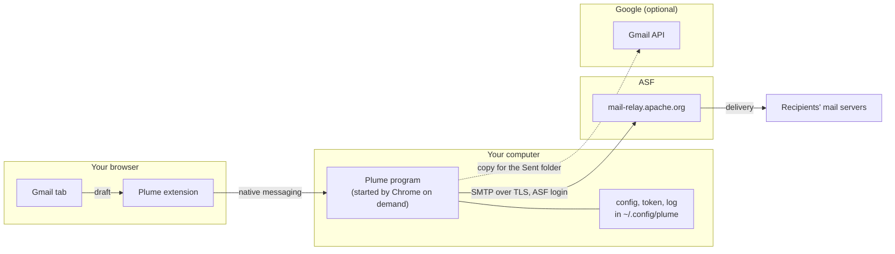
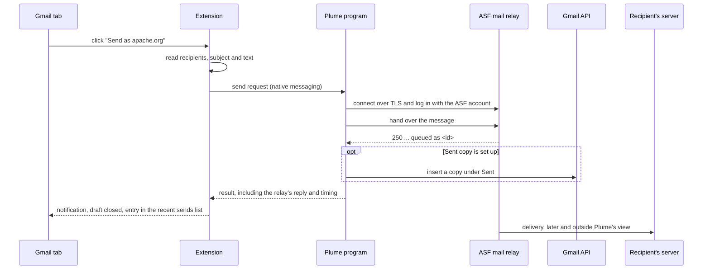

# Architecture

## The short version

Plume does not send mail itself. It hands each message to the ASF mail relay, `mail-relay.apache.org`,
which sends it on to the recipients. The relay is the ASF's own server, so the message leaves the ASF's
infrastructure with your `@apache.org` address as the sender, whatever mail client produced it.

Gmail's "Send mail as" worked the same way: for an address like `you@apache.org` you gave Gmail the
relay's host name and your ASF login, and Gmail passed your messages on to it. Google is removing that
hand-off in January 2027. Plume takes over the hand-off and moves it from Google's servers to your own
computer.

Two things do not change. Mail addressed to you still reaches Gmail through the ASF's forwarding, and
Plume is not part of that path. And nothing about the ASF's side needs to be set up for Plume: it is an
ordinary authenticated SMTP client of the relay, like Thunderbird or any other mail program.

## Who does what



| Part | Runs on | Job |
|---|---|---|
| Plume extension | Your browser, on `mail.google.com` only | Adds the button, reads the draft, shows the outcome, keeps the list of recent sends. |
| Plume program | Your computer, only while a message is being sent | Builds the message, logs in to the relay, hands the message over, optionally files a copy in Gmail. |
| ASF mail relay | ASF infrastructure | Checks the login, accepts the message and delivers it to the recipients' mail servers. |
| Gmail API | Google | Only used for the optional copy in the Sent folder, with insert-only access. |

## The path of one message



The green notification appears after the relay's reply, so it means "the ASF relay has taken the message".
Everything after that, including the relay's queue and the recipient's server, happens without Plume. That
is why the notification shows the relay's queue ID: it is what ASF Infrastructure needs to trace a message
that arrives late.

## Why the relay, and not Gmail

A receiving mail server asks whether the machine that sent a message is one that the owner of the sender's
domain allows to send for it. The ASF allows its own relay to send for `apache.org`. Google's servers are
not on that list. A message with an `@apache.org` sender that left through Google's servers would look
like forged mail, so it has to go through the ASF relay. How the ASF sets this up (which checks it
publishes and which it signs) is the ASF's business and is not something Plume controls.

The relay needs proof that you may use it, which is why Plume asks for your ASF user name and password.
The connection is encrypted: STARTTLS on port 587 or implicit TLS on port 465.

## What Plume does not do

- It does not relay, sign or store mail. The message goes to the ASF relay unchanged apart from the
  headers Plume adds (`Date`, `Message-ID`, and `In-Reply-To` and `References` for replies).
- It is not in the path of incoming mail.
- It does not read your Gmail. The optional Sent copy uses a scope that can insert messages but cannot
  read or send them.
- It does not send anything to servers other than the ASF relay and, if you set up the Sent copy, Google.

## Inside the Plume program

The send logic sits behind small interfaces, called ports, and each port has a fake in the tests.

```
app.py (HTTP, debugging) ┐
native.py (Chrome host)  ┴-> api.send_payload -> service.SendService -> ports.Mailer      <- relay.SmtpRelayMailer
                                                                       -> ports.SentArchive <- gmail.GmailArchive | archive.NullArchive
gmail.GmailArchive -> tokens.TokenProvider -> oauth.GoogleOAuth, ports.TokenStore <- tokens.FileTokenStore
                   -> ports.Transport <- transport.UrllibTransport
```

- `native.py` and `app.py` are the two ways in: Chrome's native messaging, and a token-protected HTTP
  endpoint for debugging. Both call `api.send_payload`, so a send behaves the same either way.
- `service.SendService` sends through the mailer first and then tries to archive a copy. A mailer failure
  is a failed send. An archive failure is only reported, because the mail is already out.
- `relay.SmtpRelayMailer` is the only code that talks to the ASF relay. It also records the relay's reply
  to the DATA command, which carries the queue ID.
- `wiring.py` builds this graph from the configuration, and `cli.py` exposes it as commands.

To add another kind of archive, such as IMAP APPEND, implement `SentArchive` and select it in `wiring.py`.

## What is stored, and where

| What | Where | Notes |
|---|---|---|
| ASF user name and password | `~/.config/plume/config.json` | Mode 0600, not encrypted. |
| Gmail authorization token | `~/.config/plume/gmail-token.json` | Only if the Sent copy is set up. Mode 0600. |
| Program log | `~/.config/plume/host.log` | Errors from the native host. Chrome discards its stderr. |
| Recent sends | `chrome.storage.local` in the browser | Last 50: recipients, subject, outcome, relay reply. Never the message text. |
| Extension settings | `chrome.storage.local` in the browser | The `@apache.org` address, and the HTTP debugging options. |

## Where a failure shows up

| Failure | Detected by | Shown as |
|---|---|---|
| No recipient, or no text | Extension, before anything is sent | Red notification, nothing sent. |
| Program not installed, or not answering | Extension | Red notification, nothing sent. |
| Wrong ASF login, relay unreachable or refusing | Plume program | Red notification with the relay's reason, nothing sent. |
| Reply headers not readable | Extension | Amber notification. The mail is sent but may not thread in list archives. |
| Sent copy could not be filed | Plume program | Noted in the notification. The mail is sent. |
| Delivery is slow, or a message is held | After the relay accepted it | Not visible to Plume. Use the queue ID and the `Received:` headers, see the user guide. |

## Related documents

- [Design notes](design.md): why it is built this way, the security model and the open questions.
- [User guide](user-guide.md): installing and using Plume.
- [Maintaining the Gmail selectors](selectors.md): the part most likely to break when Gmail changes.
